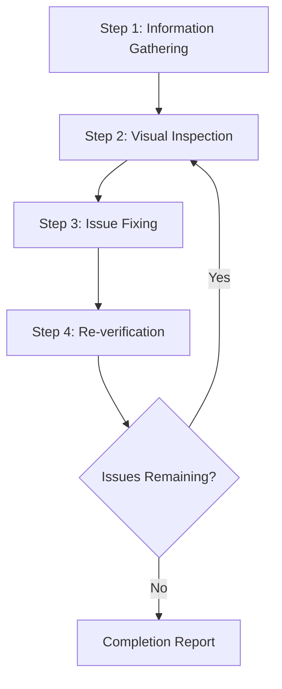
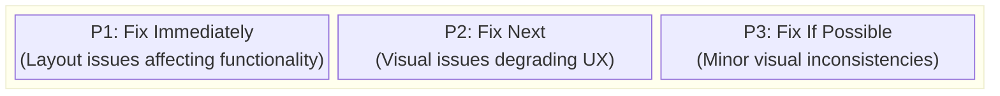
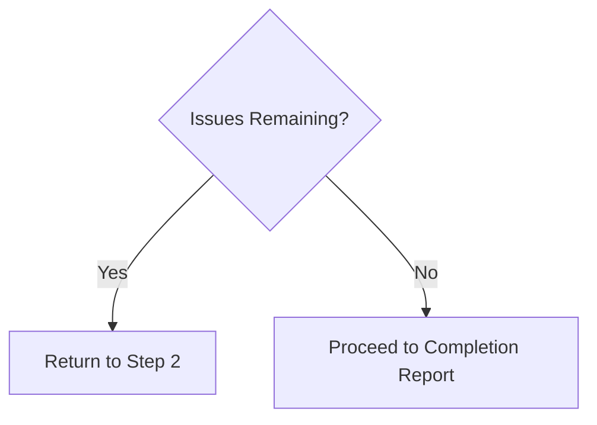

# Web Design Reviewer

This skill enables visual inspection and validation of website design quality, identifying and fixing issues at the source code level.

## Scope of Application

- Static sites (HTML/CSS/JS)
- SPA frameworks such as React / Vue / Angular / Svelte
- Full-stack frameworks such as Next.js / Nuxt / SvelteKit
- CMS platforms such as WordPress / Drupal
- Any other web application

## Prerequisites

### Required

1. **Target website must be running**
   - Local development server (e.g., `http://localhost:3000`)
   - Staging environment
   - Production environment (for read-only reviews)

2. **Browser automation must be available**
   - Screenshot capture
   - Page navigation
   - DOM information retrieval

3. **Access to source code (when making fixes)**
   - Project must exist within the workspace

## Workflow Overview



---

## Step 1: Information Gathering Phase

### 1.1 URL Confirmation

If the URL is not provided, ask the user:

> Please provide the URL of the website to review (e.g., `http://localhost:3000`)

### 1.2 Understanding Project Structure

When making fixes, gather the following information:

| Item | Example Question |
|------|------------------|
| Framework | Are you using React / Vue / Next.js, etc.? |
| Styling Method | CSS / SCSS / Tailwind / CSS-in-JS, etc. |
| Source Location | Where are style files and components located? |
| Review Scope | Specific pages only or entire site? |

### 1.3 Automatic Project Detection

Attempt automatic detection from files in the workspace:

```
Detection targets:
├── package.json     → Framework and dependencies
├── tsconfig.json    → TypeScript usage
├── tailwind.config  → Tailwind CSS
├── next.config      → Next.js
├── vite.config      → Vite
├── nuxt.config      → Nuxt
└── src/ or app/     → Source directory
```

### 1.4 Identifying Styling Method

| Method | Detection | Edit Target |
|--------|-----------|-------------|
| Pure CSS | `*.css` files | Global CSS or component CSS |
| SCSS/Sass | `*.scss`, `*.sass` | SCSS files |
| CSS Modules | `*.module.css` | Module CSS files |
| Tailwind CSS | `tailwind.config.*` | className in components |
| styled-components | `styled.` in code | JS/TS files |
| Emotion | `@emotion/` imports | JS/TS files |
| CSS-in-JS (other) | Inline styles | JS/TS files |

---

## Step 2: Visual Inspection Phase

### 2.1 Page Traversal

1. Navigate to the specified URL
2. Capture screenshots
3. Retrieve DOM structure/snapshot (if possible)
4. If additional pages exist, traverse through navigation

### 2.2 Inspection Items

#### Layout Issues

| Issue | Description | Severity |
|-------|-------------|----------|
| Element Overflow | Content overflows from parent element or viewport | High |
| Element Overlap | Unintended overlapping of elements | High |
| Alignment Issues | Grid or flex alignment problems | Medium |
| Inconsistent Spacing | Padding/margin inconsistencies | Medium |
| Text Clipping | Long text not handled properly | Medium |

#### Responsive Issues

| Issue | Description | Severity |
|-------|-------------|----------|
| Non-mobile Friendly | Layout breaks on small screens | High |
| Breakpoint Issues | Unnatural transitions when screen size changes | Medium |
| Touch Targets | Buttons too small on mobile | Medium |

#### Accessibility Issues

| Issue | Description | Severity |
|-------|-------------|----------|
| Insufficient Contrast | Low contrast ratio between text and background | High |
| No Focus State | Cannot determine state during keyboard navigation | High |
| Missing alt Text | No alternative text for images | Medium |

#### Visual Consistency

| Issue | Description | Severity |
|-------|-------------|----------|
| Font Inconsistency | Mixed font families | Medium |
| Color Inconsistency | Non-unified brand colors | Medium |
| Spacing Inconsistency | Non-uniform spacing between similar elements | Low |

### 2.3 Viewport Testing (Responsive)

Test at the following viewports:

| Name | Width | Representative Device |
|------|-------|----------------------|
| Mobile | 375px | iPhone SE/12 mini |
| Tablet | 768px | iPad |
| Desktop | 1280px | Standard PC |
| Wide | 1920px | Large display |

---

## Step 3: Issue Fixing Phase

### 3.1 Issue Prioritization



### 3.2 Identifying Source Files

Identify source files from problematic elements:

1. **Selector-based Search**
   - Search codebase by class name or ID
   - Explore style definitions with `grep_search`

2. **Component-based Search**
   - Identify components from element text or structure
   - Explore related files with `semantic_search`

3. **File Pattern Filtering**
   ```
   Style files: src/**/*.css, styles/**/*
   Components: src/components/**/*
   Pages: src/pages/**, app/**
   ```

### 3.3 Applying Fixes

#### Framework-specific Fix Guidelines

See [references/framework-fixes.md](references/framework-fixes.md) for details.

#### Fix Principles

1. **Minimal Changes**: Only make the minimum changes necessary to resolve the issue
2. **Respect Existing Patterns**: Follow existing code style in the project
3. **Avoid Breaking Changes**: Be careful not to affect other areas
4. **Add Comments**: Add comments to explain the reason for fixes where appropriate

---

## Step 4: Re-verification Phase

### 4.1 Post-fix Confirmation

1. Reload browser (or wait for development server HMR)
2. Capture screenshots of fixed areas
3. Compare before and after

### 4.2 Regression Testing

- Verify that fixes haven't affected other areas
- Confirm responsive display is not broken

### 4.3 Iteration Decision



**Iteration Limit**: If more than 3 fix attempts are needed for a specific issue, consult the user

---

## Output Format

### Review Results Report

```markdown
# Web Design Review Results

## Summary

| Item | Value |
|------|-------|
| Target URL | {URL} |
| Framework | {Detected framework} |
| Styling | {CSS / Tailwind / etc.} |
| Tested Viewports | Desktop, Mobile |
| Issues Detected | {N} |
| Issues Fixed | {M} |

## Detected Issues

### [P1] {Issue Title}

- **Page**: {Page path}
- **Element**: {Selector or description}
- **Issue**: {Detailed description of the issue}
- **Fixed File**: `{File path}`
- **Fix Details**: {Description of changes}
- **Screenshot**: Before/After

### [P2] {Issue Title}
...

## Unfixed Issues (if any)

### {Issue Title}
- **Reason**: {Why it was not fixed/could not be fixed}
- **Recommended Action**: {Recommendations for user}

## Recommendations

- {Suggestions for future improvements}
```

---

## Required Capabilities

| Capability | Description | Required |
|------------|-------------|----------|
| Web Page Navigation | Access URLs, page transitions | ✅ |
| Screenshot Capture | Page image capture | ✅ |
| Image Analysis | Visual issue detection | ✅ |
| DOM Retrieval | Page structure retrieval | Recommended |
| File Read/Write | Source code reading and editing | Required for fixes |
| Code Search | Code search within project | Required for fixes |

---

## Reference Implementation

### Implementation with Playwright MCP

[Playwright MCP](https://github.com/microsoft/playwright-mcp) is recommended as the reference implementation for this skill.

| Capability | Playwright MCP Tool | Purpose |
|------------|---------------------|---------|
| Navigation | `browser_navigate` | Access URLs |
| Snapshot | `browser_snapshot` | Retrieve DOM structure |
| Screenshot | `browser_take_screenshot` | Images for visual inspection |
| Click | `browser_click` | Interact with interactive elements |
| Resize | `browser_resize` | Responsive testing |
| Console | `browser_console_messages` | Detect JS errors |

#### Configuration Example (MCP Server)

```json
{
  "mcpServers": {
    "playwright": {
      "command": "npx",
      "args": ["-y", "@playwright/mcp@latest", "--caps=vision"]
    }
  }
}
```

### Other Compatible Browser Automation Tools

| Tool | Features |
|------|----------|
| Selenium | Broad browser support, multi-language support |
| Puppeteer | Chrome/Chromium focused, Node.js |
| Cypress | Easy integration with E2E testing |
| WebDriver BiDi | Standardized next-generation protocol |

The same workflow can be implemented with these tools. As long as they provide the necessary capabilities (navigation, screenshot, DOM retrieval), the choice of tool is flexible.

---

## Best Practices

### DO (Recommended)

- ✅ Always save screenshots before making fixes
- ✅ Fix one issue at a time and verify each
- ✅ Follow the project's existing code style
- ✅ Confirm with user before major changes
- ✅ Document fix details thoroughly

### DON'T (Not Recommended)

- ❌ Large-scale refactoring without confirmation
- ❌ Ignoring design systems or brand guidelines
- ❌ Fixes that ignore performance
- ❌ Fixing multiple issues at once (difficult to verify)

---

## Troubleshooting

### Problem: Style files not found

1. Check dependencies in `package.json`
2. Consider the possibility of CSS-in-JS
3. Consider CSS generated at build time
4. Ask user about styling method

### Problem: Fixes not reflected

1. Check if development server HMR is working
2. Clear browser cache
3. Rebuild if project requires build
4. Check CSS specificity issues

### Problem: Fixes affecting other areas

1. Rollback changes
2. Use more specific selectors
3. Consider using CSS Modules or scoped styles
4. Consult user to confirm impact scope

---

## Reference: framework-fixes

# Framework-specific Fix Guide

This document explains specific fix techniques for each framework and styling method.

---

## Pure CSS / SCSS

### Fixing Layout Overflow

```css
/* Before: Overflow occurs */
.container {
  width: 100%;
}

/* After: Control overflow */
.container {
  width: 100%;
  max-width: 100%;
  overflow-x: hidden;
}
```

### Text Clipping Prevention

```css
/* Single line truncation */
.text-truncate {
  overflow: hidden;
  text-overflow: ellipsis;
  white-space: nowrap;
}

/* Multi-line truncation */
.text-clamp {
  display: -webkit-box;
  -webkit-line-clamp: 3;
  -webkit-box-orient: vertical;
  overflow: hidden;
}

/* Word wrapping */
.text-wrap {
  word-wrap: break-word;
  overflow-wrap: break-word;
  hyphens: auto;
}
```

### Spacing Unification

```css
/* Unify spacing with CSS custom properties */
:root {
  --spacing-xs: 0.25rem;
  --spacing-sm: 0.5rem;
  --spacing-md: 1rem;
  --spacing-lg: 1.5rem;
  --spacing-xl: 2rem;
}

.card {
  padding: var(--spacing-md);
  margin-bottom: var(--spacing-lg);
}
```

### Improving Contrast

```css
/* Before: Insufficient contrast */
.text {
  color: #999999;
  background-color: #ffffff;
}

/* After: Meets WCAG AA standards */
.text {
  color: #595959; /* Contrast ratio 7:1 */
  background-color: #ffffff;
}
```

---

## Tailwind CSS

### Layout Fixes

```jsx
{/* Before: Overflow */}
<div className="w-full">
  
</div>

{/* After: Overflow control */}
<div className="w-full max-w-full overflow-hidden">
  
</div>
```

### Text Clipping Prevention

```jsx
{/* Single line truncation */}
<p className="truncate">Long text...</p>

{/* Multi-line truncation */}
<p className="line-clamp-3">Long text...</p>

{/* Allow wrapping */}
<p className="break-words">Long text...</p>
```

### Responsive Support

```jsx
{/* Mobile-first responsive */}
<div className="
  flex flex-col gap-4
  md:flex-row md:gap-6
  lg:gap-8
">
  <div className="w-full md:w-1/2 lg:w-1/3">
    Content
  </div>
</div>
```

### Spacing Unification (Tailwind Config)

```javascript
// tailwind.config.js
module.exports = {
  theme: {
    extend: {
      spacing: {
        '18': '4.5rem',
        '22': '5.5rem',
      },
    },
  },
}
```

### Accessibility Improvements

```jsx
{/* Add focus state */}
<button className="
  bg-blue-500 text-white
  hover:bg-blue-600
  focus:outline-none focus:ring-2 focus:ring-blue-500 focus:ring-offset-2
">
  Button
</button>

{/* Improve contrast */}
<p className="text-gray-700 bg-white"> {/* Changed from text-gray-500 */}
  Readable text
</p>
```

---

## React + CSS Modules

### Fixes in Module Scope

```css
/* Component.module.css */

/* Before */
.container {
  display: flex;
}

/* After: Add overflow control */
.container {
  display: flex;
  flex-wrap: wrap;
  overflow: hidden;
  max-width: 100%;
}
```

### Component-side Fixes

```jsx
// Component.jsx
import styles from './Component.module.css';

// Before
<div className={styles.container}>

// After: Add conditional class
<div className={`${styles.container} ${isOverflow ? styles.overflow : ''}`}>
```

---

## styled-components / Emotion

### Style Fixes

```jsx
// Before
const Container = styled.div`
  width: 100%;
`;

// After
const Container = styled.div`
  width: 100%;
  max-width: 100%;
  overflow-x: hidden;
  
  @media (max-width: 768px) {
    padding: 1rem;
  }
`;
```

### Responsive Support

```jsx
const Card = styled.div`
  display: grid;
  grid-template-columns: repeat(3, 1fr);
  gap: 1.5rem;
  
  @media (max-width: 1024px) {
    grid-template-columns: repeat(2, 1fr);
  }
  
  @media (max-width: 640px) {
    grid-template-columns: 1fr;
    gap: 1rem;
  }
`;
```

### Consistency with Theme

```jsx
// theme.js
export const theme = {
  colors: {
    primary: '#2563eb',
    text: '#1f2937',
    textLight: '#4b5563', // Improved contrast
  },
  spacing: {
    sm: '0.5rem',
    md: '1rem',
    lg: '1.5rem',
  },
};

// Usage
const Text = styled.p`
  color: ${({ theme }) => theme.colors.text};
  margin-bottom: ${({ theme }) => theme.spacing.md};
`;
```

---

## Vue (Scoped Styles)

### Fixing Scoped Styles

```vue
<template>
  <div class="container">
    <p class="text">Content</p>
  </div>
</template>

<style scoped>
/* Applied only to this component */
.container {
  max-width: 100%;
  overflow: hidden;
}

.text {
  /* Fix: Improve contrast */
  color: #374151; /* Was: #9ca3af */
}

/* Responsive */
@media (max-width: 768px) {
  .container {
    padding: 1rem;
  }
}
</style>
```

### Deep Selectors (Affecting Child Components)

```vue
<style scoped>
/* Override child component styles (use cautiously) */
:deep(.child-class) {
  margin-bottom: 1rem;
}
</style>
```

---

## Next.js / App Router

### Global Style Fixes

```css
/* app/globals.css */
:root {
  --foreground: #171717;
  --background: #ffffff;
}

/* Prevent layout overflow */
html, body {
  max-width: 100vw;
  overflow-x: hidden;
}

/* Prevent image overflow */
img {
  max-width: 100%;
  height: auto;
}
```

### Fixes in Layout Components

```tsx
// app/layout.tsx
export default function RootLayout({ children }) {
  return (
    <html lang="en">
      <body className="min-h-screen flex flex-col">
        <header className="sticky top-0 z-50">
          {/* Header */}
        </header>
        <main className="flex-1 container mx-auto px-4 py-8">
          {children}
        </main>
        <footer>
          {/* Footer */}
        </footer>
      </body>
    </html>
  );
}
```

---

## Common Patterns

### Fixing Flexbox Layout Issues

```css
/* Before: Items overflow */
.flex-container {
  display: flex;
  gap: 1rem;
}

/* After: Wrap and size control */
.flex-container {
  display: flex;
  flex-wrap: wrap;
  gap: 1rem;
}

.flex-item {
  flex: 1 1 300px; /* grow, shrink, basis */
  min-width: 0; /* Prevent flexbox overflow issues */
}
```

### Fixing Grid Layout Issues

```css
/* Before: Fixed column count */
.grid-container {
  display: grid;
  grid-template-columns: repeat(4, 1fr);
}

/* After: Auto-adjust */
.grid-container {
  display: grid;
  grid-template-columns: repeat(auto-fit, minmax(250px, 1fr));
  gap: 1.5rem;
}
```

### Organizing z-index

```css
/* Systematize z-index */
:root {
  --z-dropdown: 100;
  --z-sticky: 200;
  --z-modal-backdrop: 300;
  --z-modal: 400;
  --z-tooltip: 500;
}

.modal {
  z-index: var(--z-modal);
}
```

### Adding Focus States

```css
/* Add focus state to all interactive elements */
button:focus-visible,
a:focus-visible,
input:focus-visible,
select:focus-visible,
textarea:focus-visible {
  outline: 2px solid #2563eb;
  outline-offset: 2px;
}

/* Customize focus ring */
.custom-focus:focus-visible {
  outline: none;
  box-shadow: 0 0 0 3px rgba(37, 99, 235, 0.5);
}
```

---

## Debugging Techniques

### Visualizing Element Boundaries

```css
/* Use only during development */
* {
  outline: 1px solid red !important;
}
```

### Detecting Overflow

```javascript
// Run in console to detect overflow elements
document.querySelectorAll('*').forEach(el => {
  if (el.scrollWidth > el.clientWidth) {
    console.log('Horizontal overflow:', el);
  }
  if (el.scrollHeight > el.clientHeight) {
    console.log('Vertical overflow:', el);
  }
});
```

### Checking Contrast Ratio

```javascript
// Use Chrome DevTools Lighthouse or axe DevTools
// Or check at the following site:
// https://webaim.org/resources/contrastchecker/
```

---

## Reference: visual-checklist

# Visual Inspection Checklist

This document is a comprehensive checklist of items to verify during web design visual inspection.

---

## 1. Layout Verification

### Structural Integrity

- [ ] Header is correctly fixed/positioned at the top of the screen
- [ ] Footer is positioned at the bottom of the screen or end of content
- [ ] Main content area is center-aligned with appropriate width
- [ ] Sidebar (if present) is positioned correctly
- [ ] Navigation is displayed in the intended position

### Overflow

- [ ] Horizontal scrollbar is not unintentionally displayed
- [ ] Content does not overflow from parent elements
- [ ] Images fit within parent containers
- [ ] Tables do not exceed container width
- [ ] Code blocks wrap or scroll appropriately

### Alignment

- [ ] Grid items are evenly distributed
- [ ] Flex item alignment is correct
- [ ] Text alignment (left/center/right) is consistent
- [ ] Icons and text are vertically aligned
- [ ] Form labels and input fields are correctly positioned

---

## 2. Typography Verification

### Readability

- [ ] Body text font size is sufficient (minimum 16px recommended)
- [ ] Line height is appropriate (1.5-1.8 recommended)
- [ ] Characters per line is appropriate (40-80 characters recommended)
- [ ] Spacing between paragraphs is sufficient
- [ ] Heading size hierarchy is clear

### Text Handling

- [ ] Long words wrap appropriately
- [ ] URLs and code are handled properly
- [ ] No text clipping occurs
- [ ] Ellipsis (...) displays correctly
- [ ] Language-specific line breaking rules work correctly

### Fonts

- [ ] Web fonts load correctly
- [ ] Fallback fonts are appropriate
- [ ] Font weights are as intended
- [ ] Special characters and emoji display correctly

---

## 3. Color & Contrast Verification

### Accessibility (WCAG Standards)

- [ ] Body text: Contrast ratio 4.5:1 or higher (AA)
- [ ] Large text (18px+ bold or 24px+): 3:1 or higher
- [ ] Interactive element borders: 3:1 or higher
- [ ] Focus indicators: Sufficient contrast with background

### Color Consistency

- [ ] Brand colors are unified
- [ ] Link colors are consistent
- [ ] Error state red is unified
- [ ] Success state green is unified
- [ ] Hover/active state colors are appropriate

### Color Vision Diversity

- [ ] Information conveyed by shape and text, not just color
- [ ] Charts and diagrams consider color vision diversity
- [ ] Error messages don't rely solely on color

---

## 4. Responsive Verification

### Mobile (~640px)

- [ ] Content fits within screen width
- [ ] Touch targets are 44x44px or larger
- [ ] Text is readable size
- [ ] No horizontal scrolling occurs
- [ ] Navigation is mobile-friendly (hamburger menu, etc.)
- [ ] Form inputs are easy to use

### Tablet (641px~1024px)

- [ ] Layout is optimized for tablet
- [ ] Two-column layouts display appropriately
- [ ] Image sizes are appropriate
- [ ] Sidebar show/hide is appropriate

### Desktop (1025px~)

- [ ] Maximum width is set and doesn't break on extra-large screens
- [ ] Spacing is sufficient
- [ ] Multi-column layouts function correctly
- [ ] Hover states are implemented

### Breakpoint Transitions

- [ ] Layout transitions smoothly when screen size changes
- [ ] Layout doesn't break at intermediate sizes
- [ ] No content disappears or duplicates

---

## 5. Interactive Element Verification

### Buttons

- [ ] Default state is clear
- [ ] Hover state exists (desktop)
- [ ] Focus state is visually clear
- [ ] Active (pressed) state exists
- [ ] Disabled state is distinguishable
- [ ] Loading state (if applicable)

### Links

- [ ] Links are visually identifiable
- [ ] Visited links are distinguishable (if needed)
- [ ] Hover state exists
- [ ] Focus state is clear

### Form Elements

- [ ] Input field boundaries are clear
- [ ] Placeholder text contrast is appropriate
- [ ] Visual feedback on focus
- [ ] Error state display
- [ ] Required field indication
- [ ] Dropdowns function correctly

---

## 6. Images & Media Verification

### Images

- [ ] Images display at appropriate size
- [ ] Aspect ratio is maintained
- [ ] High resolution display support (@2x)
- [ ] Display when image fails to load
- [ ] Lazy loading behavior works

### Video & Embeds

- [ ] Videos fit within containers
- [ ] Aspect ratio is maintained
- [ ] Embedded content is responsive
- [ ] iframes don't overflow

---

## 7. Accessibility Verification

### Keyboard Navigation

- [ ] All interactive elements accessible via Tab key
- [ ] Focus order is logical
- [ ] Focus traps are appropriate (modals, etc.)
- [ ] Skip to content link exists

### Screen Reader Support

- [ ] Images have alt text
- [ ] Forms have labels
- [ ] ARIA labels are appropriately set
- [ ] Heading hierarchy is correct (h1→h2→h3...)

### Motion

- [ ] Animations are not excessive
- [ ] prefers-reduced-motion is supported (if possible)

---

## 8. Performance-related Visual Issues

### Loading

- [ ] Font FOUT/FOIT is minimal
- [ ] No layout shift (CLS) occurs
- [ ] No jumping when images load
- [ ] Skeleton screens are appropriate (if applicable)

### Animation

- [ ] Animations are smooth (60fps)
- [ ] No performance issues when scrolling
- [ ] Transitions are natural

---

## Priority Matrix

| Priority | Category | Examples |
|----------|----------|----------|
| P0 (Critical) | Functionality breaking | Complete element overlap, content disappearance |
| P1 (High) | Serious UX issues | Unreadable text, inoperable buttons |
| P2 (Medium) | Moderate issues | Alignment issues, spacing inconsistencies |
| P3 (Low) | Minor issues | Slight positioning differences, minor color variations |

---

## Verification Tools

### Browser DevTools

- Elements panel: DOM and style inspection
- Lighthouse: Performance and accessibility audits
- Device toolbar: Responsive testing

### Accessibility Tools

- axe DevTools
- WAVE
- Color Contrast Analyzer

### Automation Tools

- Playwright (screenshot comparison)
- Percy / Chromatic (Visual Regression Testing)
