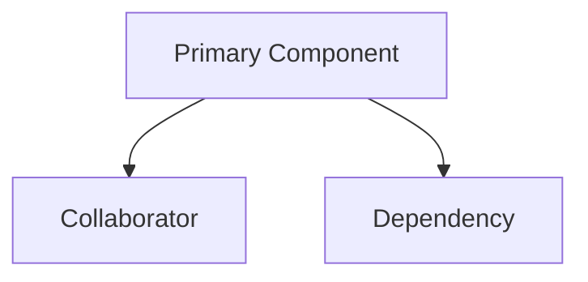

# [Component Name] Documentation

[Concise introduction describing the component purpose and role in the system.]

## 1. Component Overview

### Purpose/Responsibility

- OVR-001: State the component's primary responsibility
- OVR-002: Define scope, including included and excluded responsibilities
- OVR-003: Describe system context and major relationships

## 2. Architecture Section

- ARC-001: Document design patterns used
- ARC-002: List internal and external dependencies with their purpose
- ARC-003: Describe component interactions and relationships
- ARC-004: Include visual diagrams where they clarify structure or behavior
- ARC-005: Provide a Mermaid diagram showing structure, relationships, and dependencies

### Component Structure and Dependencies Diagram

Show the current:

- Component structure
- Internal dependencies
- External dependencies
- Data flow
- Inheritance and composition relationships



## 3. Interface Documentation

- INT-001: Document public interfaces and usage patterns
- INT-002: Provide a method or property reference table
- INT-003: Cover events, callbacks, or notification mechanisms when applicable

| Method/Property | Purpose | Parameters | Return Type | Usage Notes |
|-----------------|---------|------------|-------------|-------------|
| [Name] | [Purpose] | [Parameters] | [Type] | [Notes] |

## 4. Implementation Details

- IMP-001: Describe main implementation classes and responsibilities
- IMP-002: Capture configuration requirements and initialization patterns
- IMP-003: Summarize key algorithms or business logic
- IMP-004: Note performance characteristics and bottlenecks

## 5. Usage Examples

### Basic Usage

```text
[Basic usage example aligned with the component language and API]
```

### Advanced Usage

```text
[Advanced configuration or orchestration example aligned with the current implementation]
```

- USE-001: Provide basic usage examples
- USE-002: Show advanced configuration patterns
- USE-003: Document best practices and recommended patterns

## 6. Quality Attributes

- QUA-001: Security
- QUA-002: Performance
- QUA-003: Reliability
- QUA-004: Maintainability
- QUA-005: Extensibility

## 7. Reference Information

- REF-001: List dependencies with versions and purposes where available
- REF-002: Document configuration options
- REF-003: Provide testing guidance and mock setup notes
- REF-004: Capture troubleshooting notes and common issues
- REF-005: Link related documentation
- REF-006: Add change history or migration notes when relevant
