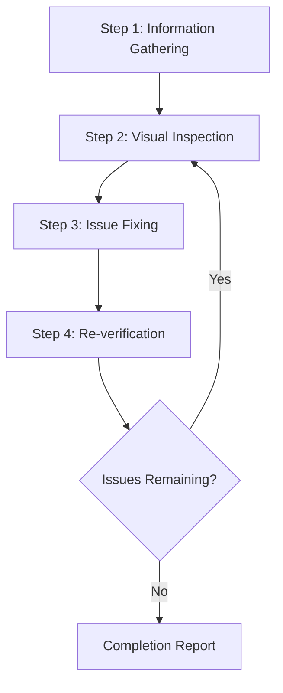
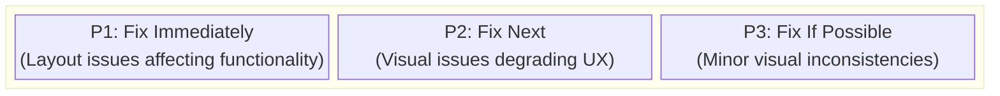
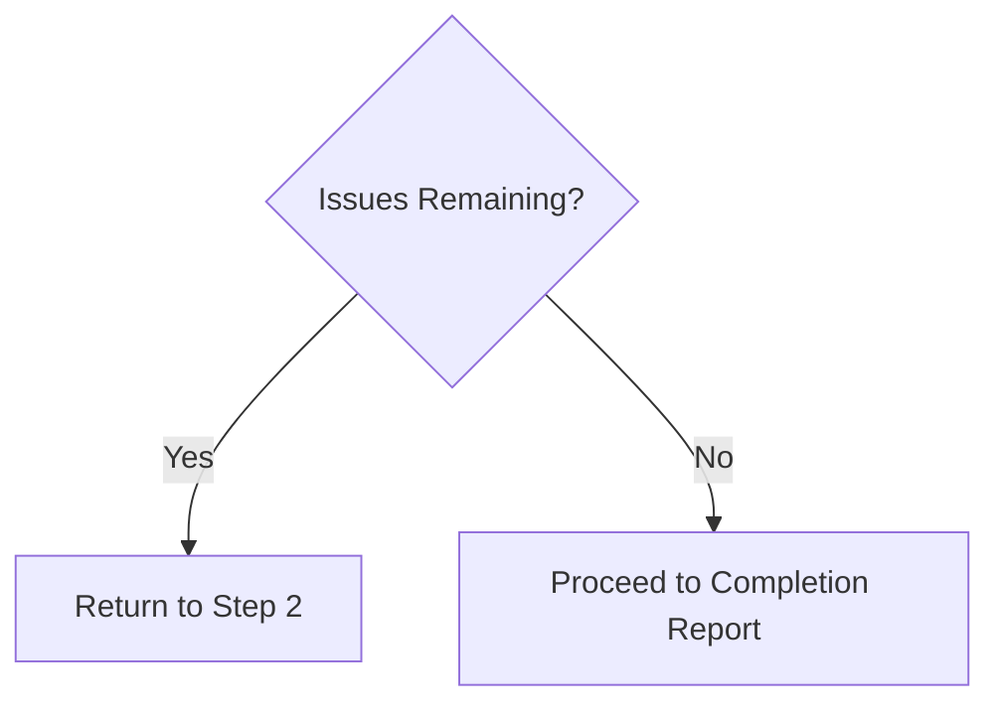

# Web Design Reviewer

This skill enables visual inspection and validation of website design quality, identifying and fixing issues at the source code level.

## Scope of Application

- Static sites (HTML/CSS/JS)
- SPA frameworks such as React / Vue / Angular / Svelte
- Full-stack frameworks such as Next.js / Nuxt / SvelteKit
- CMS platforms such as WordPress / Drupal
- Any other web application

## Prerequisites

### Required

1. **Target website must be running**
   - Local development server (e.g., `http://localhost:3000`)
   - Staging environment
   - Production environment (for read-only reviews)

2. **Browser automation must be available**
   - Screenshot capture
   - Page navigation
   - DOM information retrieval

3. **Access to source code (when making fixes)**
   - Project must exist within the workspace

## Workflow Overview



---

## Step 1: Information Gathering Phase

### 1.1 URL Confirmation

If the URL is not provided, ask the user:

> Please provide the URL of the website to review (e.g., `http://localhost:3000`)

### 1.2 Understanding Project Structure

When making fixes, gather the following information:

| Item | Example Question |
|------|------------------|
| Framework | Are you using React / Vue / Next.js, etc.? |
| Styling Method | CSS / SCSS / Tailwind / CSS-in-JS, etc. |
| Source Location | Where are style files and components located? |
| Review Scope | Specific pages only or entire site? |

### 1.3 Automatic Project Detection

Attempt automatic detection from files in the workspace:

```
Detection targets:
├── package.json     → Framework and dependencies
├── tsconfig.json    → TypeScript usage
├── tailwind.config  → Tailwind CSS
├── next.config      → Next.js
├── vite.config      → Vite
├── nuxt.config      → Nuxt
└── src/ or app/     → Source directory
```

### 1.4 Identifying Styling Method

| Method | Detection | Edit Target |
|--------|-----------|-------------|
| Pure CSS | `*.css` files | Global CSS or component CSS |
| SCSS/Sass | `*.scss`, `*.sass` | SCSS files |
| CSS Modules | `*.module.css` | Module CSS files |
| Tailwind CSS | `tailwind.config.*` | className in components |
| styled-components | `styled.` in code | JS/TS files |
| Emotion | `@emotion/` imports | JS/TS files |
| CSS-in-JS (other) | Inline styles | JS/TS files |

---

## Step 2: Visual Inspection Phase

### 2.1 Page Traversal

1. Navigate to the specified URL
2. Capture screenshots
3. Retrieve DOM structure/snapshot (if possible)
4. If additional pages exist, traverse through navigation

### 2.2 Inspection Items

#### Layout Issues

| Issue | Description | Severity |
|-------|-------------|----------|
| Element Overflow | Content overflows from parent element or viewport | High |
| Element Overlap | Unintended overlapping of elements | High |
| Alignment Issues | Grid or flex alignment problems | Medium |
| Inconsistent Spacing | Padding/margin inconsistencies | Medium |
| Text Clipping | Long text not handled properly | Medium |

#### Responsive Issues

| Issue | Description | Severity |
|-------|-------------|----------|
| Non-mobile Friendly | Layout breaks on small screens | High |
| Breakpoint Issues | Unnatural transitions when screen size changes | Medium |
| Touch Targets | Buttons too small on mobile | Medium |

#### Accessibility Issues

| Issue | Description | Severity |
|-------|-------------|----------|
| Insufficient Contrast | Low contrast ratio between text and background | High |
| No Focus State | Cannot determine state during keyboard navigation | High |
| Missing alt Text | No alternative text for images | Medium |

#### Visual Consistency

| Issue | Description | Severity |
|-------|-------------|----------|
| Font Inconsistency | Mixed font families | Medium |
| Color Inconsistency | Non-unified brand colors | Medium |
| Spacing Inconsistency | Non-uniform spacing between similar elements | Low |

### 2.3 Viewport Testing (Responsive)

Test at the following viewports:

| Name | Width | Representative Device |
|------|-------|----------------------|
| Mobile | 375px | iPhone SE/12 mini |
| Tablet | 768px | iPad |
| Desktop | 1280px | Standard PC |
| Wide | 1920px | Large display |

---

## Step 3: Issue Fixing Phase

### 3.1 Issue Prioritization



### 3.2 Identifying Source Files

Identify source files from problematic elements:

1. **Selector-based Search**
   - Search codebase by class name or ID
   - Explore style definitions with `grep_search`

2. **Component-based Search**
   - Identify components from element text or structure
   - Explore related files with `semantic_search`

3. **File Pattern Filtering**
   ```
   Style files: src/**/*.css, styles/**/*
   Components: src/components/**/*
   Pages: src/pages/**, app/**
   ```

### 3.3 Applying Fixes

#### Framework-specific Fix Guidelines

See [references/framework-fixes.md](references/framework-fixes.md) for details.

#### Fix Principles

1. **Minimal Changes**: Only make the minimum changes necessary to resolve the issue
2. **Respect Existing Patterns**: Follow existing code style in the project
3. **Avoid Breaking Changes**: Be careful not to affect other areas
4. **Add Comments**: Add comments to explain the reason for fixes where appropriate

---

## Step 4: Re-verification Phase

### 4.1 Post-fix Confirmation

1. Reload browser (or wait for development server HMR)
2. Capture screenshots of fixed areas
3. Compare before and after

### 4.2 Regression Testing

- Verify that fixes haven't affected other areas
- Confirm responsive display is not broken

### 4.3 Iteration Decision



**Iteration Limit**: If more than 3 fix attempts are needed for a specific issue, consult the user

---

## Output Format

### Review Results Report

```markdown
# Web Design Review Results

## Summary

| Item | Value |
|------|-------|
| Target URL | {URL} |
| Framework | {Detected framework} |
| Styling | {CSS / Tailwind / etc.} |
| Tested Viewports | Desktop, Mobile |
| Issues Detected | {N} |
| Issues Fixed | {M} |

## Detected Issues

### [P1] {Issue Title}

- **Page**: {Page path}
- **Element**: {Selector or description}
- **Issue**: {Detailed description of the issue}
- **Fixed File**: `{File path}`
- **Fix Details**: {Description of changes}
- **Screenshot**: Before/After

### [P2] {Issue Title}
...

## Unfixed Issues (if any)

### {Issue Title}
- **Reason**: {Why it was not fixed/could not be fixed}
- **Recommended Action**: {Recommendations for user}

## Recommendations

- {Suggestions for future improvements}
```

---

## Required Capabilities

| Capability | Description | Required |
|------------|-------------|----------|
| Web Page Navigation | Access URLs, page transitions | ✅ |
| Screenshot Capture | Page image capture | ✅ |
| Image Analysis | Visual issue detection | ✅ |
| DOM Retrieval | Page structure retrieval | Recommended |
| File Read/Write | Source code reading and editing | Required for fixes |
| Code Search | Code search within project | Required for fixes |

---

## Reference Implementation

### Implementation with Playwright MCP

[Playwright MCP](https://github.com/microsoft/playwright-mcp) is recommended as the reference implementation for this skill.

| Capability | Playwright MCP Tool | Purpose |
|------------|---------------------|---------|
| Navigation | `browser_navigate` | Access URLs |
| Snapshot | `browser_snapshot` | Retrieve DOM structure |
| Screenshot | `browser_take_screenshot` | Images for visual inspection |
| Click | `browser_click` | Interact with interactive elements |
| Resize | `browser_resize` | Responsive testing |
| Console | `browser_console_messages` | Detect JS errors |

#### Configuration Example (MCP Server)

```json
{
  "mcpServers": {
    "playwright": {
      "command": "npx",
      "args": ["-y", "@playwright/mcp@latest", "--caps=vision"]
    }
  }
}
```

### Other Compatible Browser Automation Tools

| Tool | Features |
|------|----------|
| Selenium | Broad browser support, multi-language support |
| Puppeteer | Chrome/Chromium focused, Node.js |
| Cypress | Easy integration with E2E testing |
| WebDriver BiDi | Standardized next-generation protocol |

The same workflow can be implemented with these tools. As long as they provide the necessary capabilities (navigation, screenshot, DOM retrieval), the choice of tool is flexible.

---

## Best Practices

### DO (Recommended)

- ✅ Always save screenshots before making fixes
- ✅ Fix one issue at a time and verify each
- ✅ Follow the project's existing code style
- ✅ Confirm with user before major changes
- ✅ Document fix details thoroughly

### DON'T (Not Recommended)

- ❌ Large-scale refactoring without confirmation
- ❌ Ignoring design systems or brand guidelines
- ❌ Fixes that ignore performance
- ❌ Fixing multiple issues at once (difficult to verify)

---

## Troubleshooting

### Problem: Style files not found

1. Check dependencies in `package.json`
2. Consider the possibility of CSS-in-JS
3. Consider CSS generated at build time
4. Ask user about styling method

### Problem: Fixes not reflected

1. Check if development server HMR is working
2. Clear browser cache
3. Rebuild if project requires build
4. Check CSS specificity issues

### Problem: Fixes affecting other areas

1. Rollback changes
2. Use more specific selectors
3. Consider using CSS Modules or scoped styles
4. Consult user to confirm impact scope
